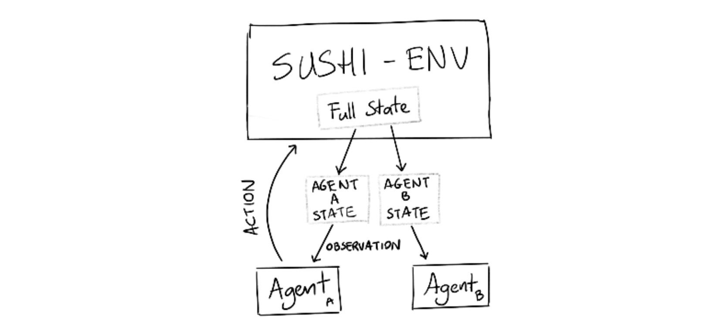

# readme

This repo contains a simple environment for the fantastic "sushi go" card game. I cannot recommend this game enough.

## api


The api is not done but it will mimic [the openai api](https://gym.openai.com/docs).


```
import sushigo
env = sushigo.make('2player')
agent = <your custom player>
observation = env.reset()
while not env.game_done:
    action = agent.act(env.state, env.action_space)
    observation, reward, done, info = env.step(action)
```

## internals

There is an internal state of the system which the agent does not get to see. All the state that is available to the agent will be passed via the observation variable.



## building/testing

If you want to build and test you'll first need to install the package. This keeps the testing clean.

```
python setup.py install
pytest tests/*
```